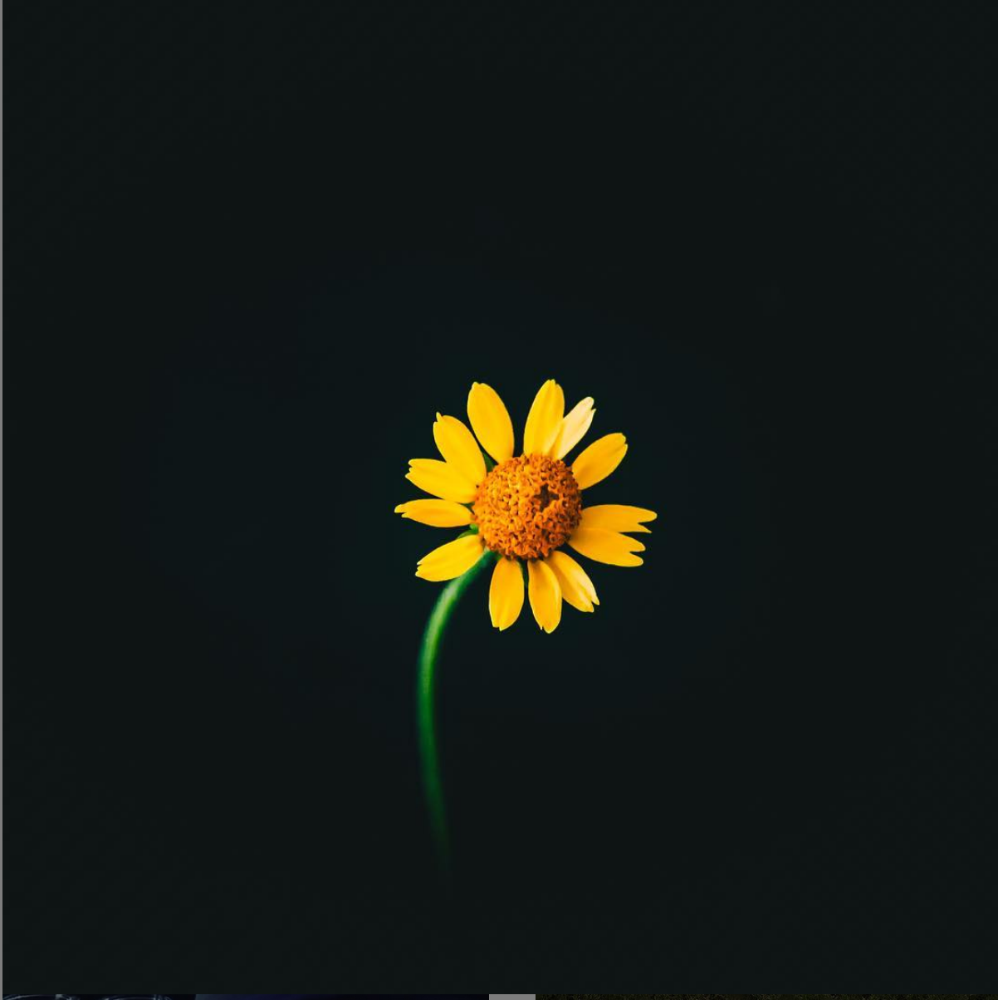

+++
date = "2018-09-02T23:22:16-05:00"
draft = false
tags = ["instagram", "20secondsofcourage"]
title = "Attempt at Showing an Instagram Post"
type = "post"
+++

> N.B. Facebook has deprecated use of their oembed api w/o registering an api key + making your website an app, so I'm copying the html generated by the old Hugo instagram shortcode below, and i'll probably simply not embed instagram anymore.

> N.B. The problem with copy-pasting the stuff is that the link for the image expired, so I've just downloaded the image, and plan to never include Instagram on my website in the future.

	

    <a href="https://www.instagram.com/calebjasik" class="card-link">calebjasik</a>
  

	
	

		
<a href="https://www.instagram.com/calebjasik" class="card-link">calebjasik</a> You know, sometimes all you need is twenty seconds of insane courage. Just literally twenty seconds of just embarrassing bravery. And I promise you, something great will come of it.
Benjamin Mee, We Bought a Zoo
—
📸 @californong found on @unsplash 
#20secondsofcourage

		<a href="https://www.instagram.com/calebjasik" class="card-link">View More on Instagram</a>
	

</div
