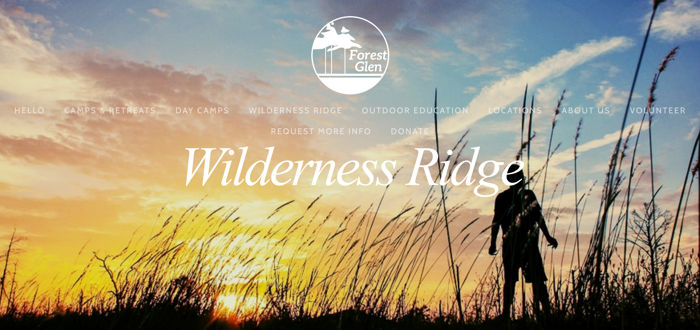

+++
Description = ""
Tags = []
Categories = []
Type = "post"
Date = "2018-01-05"
Title = "Camp Wilderness Ridge (medium.com/@jasikpark)"
+++

*Taken from [medium.com/@jasikpark](https://medium.com/@jasikpark)*

<a href="https://forestglen.org/wildernessridge">Camp Wilderness Ridge</a>

So, in mid-December, 2010 my father, little brother, and I went on a Father/Son retreat with our church. I absolutely loved the experience, the place, the staff, and the beautiful Bastrop State Park woods. I had to go there again! And so, for the summer, I arrived back at the same rustic, nature-slaps-you-in-the-face camp, for a boys summer camp, Wilderness Ridge. I made great friends, and learned a lot about teamwork along the way. In addition to crazy camp games and fun. I decided that I loved being there and that I would do anything I could to return there every summer. I discovered about two weeks after returning home from camp that the great place I was so itching to return to had burnt down. I simply accepted this in passing, as a confirmation of my view that you get something good only for a little while, so that it can be quickly taken away. But I was wrong. Camp Wilderness Ridge rebuilt two miles down the road from the scorched remains of the previous property, to where the fire had not disturbed the natural beauty. I came back a second year, and decided I wanted to volunteer after another week as a camper. I started volunteering every year, as a SALT, a Servant And Leader in Training, getting the camp games together, washing dishes, and keeping up the camp grounds. What made this so worthwhile was the impact I could have in young men’s lives doing this menial upkeep. And so I came back, every summer of my childhood. This past summer, I was able to be a counselor and play a larger part in encouraging these young men to have fun, to learn, to think, to be real men. I have deeply appreciated the impact that I have been able to achieve by working with Camp Wilderness Ridge all of these years.